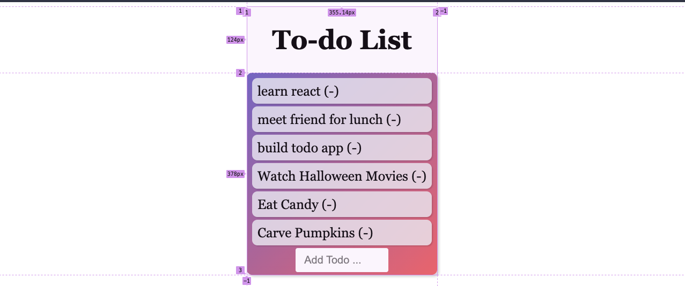

# React-Todo-Form

The Real-Time-Bus-Tracking exercise was created for MITxPro full-stack web development program.  

<a href="https://foreverphoenix21.github.io/React-Todo-Form/">
   </a
>

## Description:

 The React-Todo-Form is an input form exercise built-in React for the MITxPro web developer program. The input form was built as a CRUD todo list that is refactored, separating functions into components. 

## Installation:

 Upload the HTML file to your browser or fork and clone the project saving the files to your local hard drive. 
 

You can also run the program by clicking on the above picture in this readme file.

## Usage:

 You can use the code from this project as a framework to understand parent/child relationships and how they work together using components. Add your own divs and style this todo list to your liking. 

## Roadmap:

*
 This exercise will continually be built and improved on as I learn additional skills in Javascript. 
*

***

**
 Future updates: 
**
- Add  delete button to replace "(-)" 
- Add Time and date function to display when task was added
- Create an alarm/reminder function
- Make the form collapsible and add to floating object or Navbar

## Support:

 Want to share feedback or comments?

 
  
  Reach me on *[Linkedin](https://www.linkedin.com/in/derek-diaz/)* or *[Twitter](https://twitter.com/diazcsu.*
  

